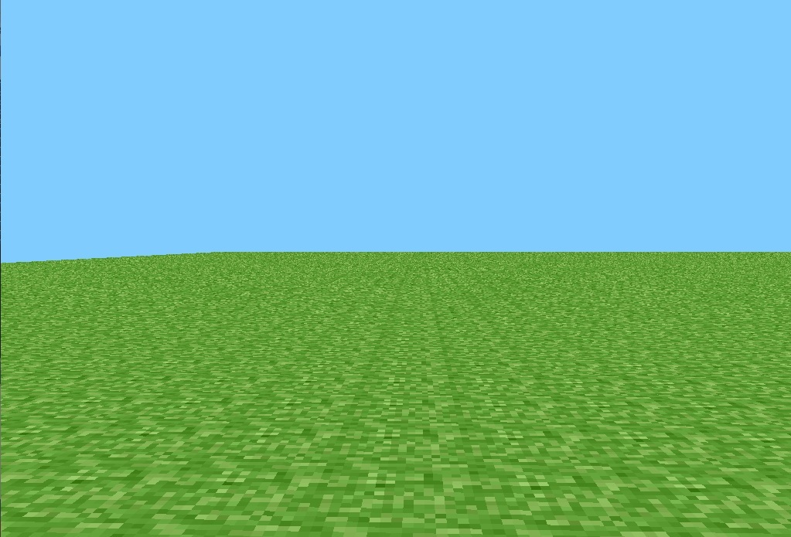
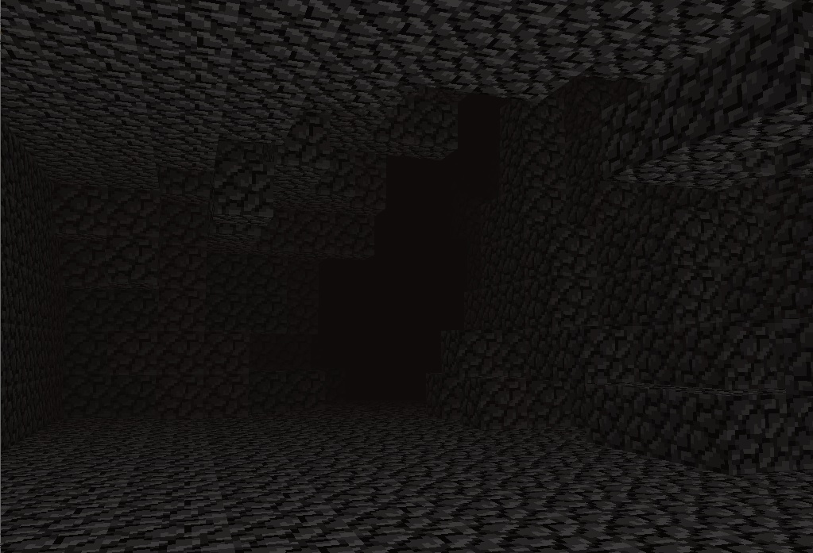
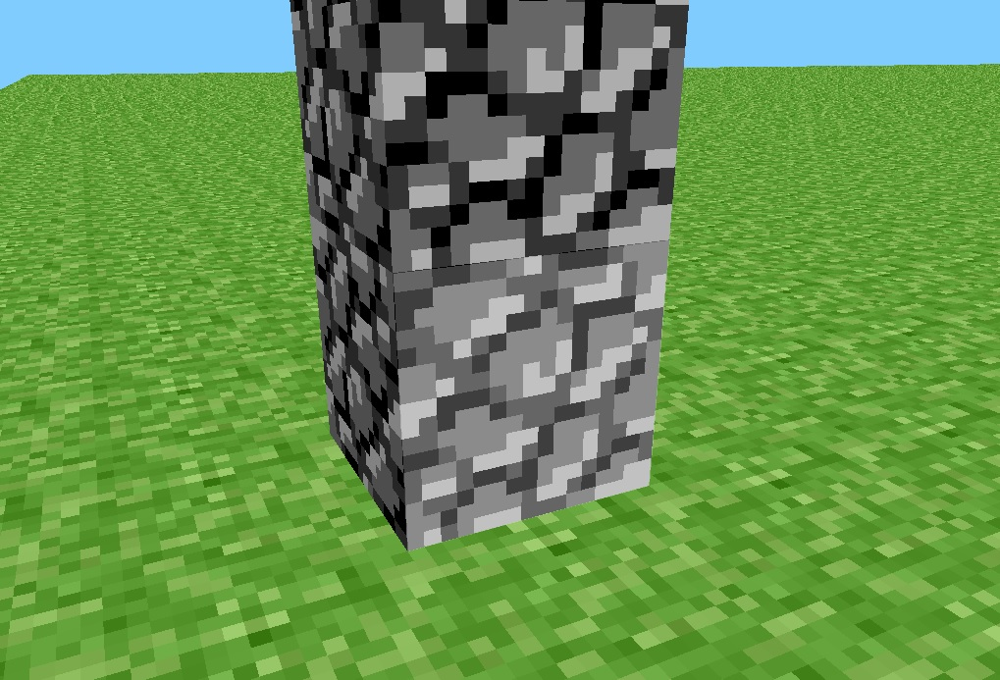

## Preclassic rd-132211

Launch date: May 13, 2009, 20:11 UTC (according to omniarchive)
c++ version launch date: Jul 25, 2025 21:07 UTC

 
Preview image from recreation.

## Introduction

This is the pre-classic Minecraft version RD-132211, rewritten in C++, incorporating 
some of the original code from the original .jar file. This version has some 
improvements over the original version, especially performance, stability, and a 
full port to the newer versions of OpenGL. This version does not change anything 
from the original version in terms of gameplay. At the moment this is very very simple
port of the original java version.

## Copyright Notice

The copyright notice include all the following elements

- C/C++ code.
- Shader code.
- Resources (images, textures and scripts)

The above elements are copyrighted by Andres26 (C) except for the following exceptions:

- External/zlib distributed under the terms of ZLIB license
- Lib/include/GLFW distrubuted under the terms of GLFW license
- Lib/include/GLEQ distributed under the terms of GLFW license
- Engine/External/glad distributed under the terms of BSD 3-Clause license
- Engine/External/glm distributed under the terms of The Happy Bunny License
- Engine/External/gzip distributed under the terms of Mapbox inc.
- Engine/External/stb_image distributed under the terms of unlicence or MIT license
- Engine/src/physics/AABB taken as-is from original rd-132211 (property of Mojang AB)
- Engine/assets/terrain.PNG (property of Mojang AB)
- Engine/assets/Internal/win_icon.PNG (property of lwjgl)

The excluded code/elements are (C) Andres26 2025, but all of part of it may be
redistributed under the following terms:

- Full source are available and free.

- The copyright notice MUST be intact.

- It is prohibited to distribute this for a fee.

If you have any question, mail me to minecraftrewrite21@gmail.com

## Limitation of liability

I, under my name, admit that this project is NOT endorsed by or affiliated with 
Mojang AB, which means that the above code is MY own as long as the copyright 
notice is observed.

## Contribute

Anyone is FREE to contribute to the project, if they are interested. I encourage 
anyone interested in this project to contribute to it.

You can contribute to the project as long as your code implements the original 
features of Minecraft. I recommend that before contributing to the code, you 
should be familiar with the original code for all Java versions (especially early versions) 
and the changelogs for older versions (see Omniarchive for more information). 
All of the above applies even if it's not a fork of the code.

## Technical summary and features of the game

This version of the game is a complete recreation of the original Java 
version. It's open source and reimplements some features of the original code.

- Rendering process: Unlike of the original version, this use shaders and 
  and only 1 draw call per chunk, Unlike the original version that used 2 "layers" 
  or drawing calls for rendering the "dark" and "light" blocks which affected the game's 
  performance.
  
- The FOG process was moved to chunk.shader, this allows avoid calls to prehistoric OpenGL

   
  Fog demostration.

- Level load process: Regardless of whether a level.dat exists, which didn't 
  happen in the original version, which generated the array using an indexer 
  and loaded the level.dat to copy it into the array. Now the game checks if 
  a level.dat exists to create it and generate the array, or alternatively, it 
  only generates the array if the level.dat doesn't exist.

- This version no longer features legacy OpenGL.

- VBO indexer: An indexer is used for vertices (uses more memory in exchange for 
  fewer drawing calls to the GPU)
  
- Selector: The selector moves and rotates using the model matrix that the application 
  passes to the shader, which avoids unnecessary calls to the drawing, each time the 
  cursor moves and repositions the selector on the selected block.
  
   
  Block selector demostration
  
- Chunk updates (CUPS): If a block is destroyed or a block on the edge of the chunk is 
  destroyed, it has to be updated for the above reason.
  
- Selector: This works as follows first it calculates the parametric equation of the camera 
  line f(t) = dir t + pos and then, using a for loop, it sets the value of t 
  (every 0.1f) and finally the ray collides with the block and returns the normal 
  of the impacted face.

## Benchmarks and tests

In my case, I managed to get an average of 300 FPS in the debug version, and in 
the release version, it averaged 400 FPS. The game also takes a while to load at 
first due to the chunk renderer and the generation of the block array in the level.

But, this is in my case, test your self and But this is in my case, I highly recommend 
you try it for yourself and encourage you to report it on github or in the attached email.

 
FPS counter from recreation

## Prerequesites for build

- Visual Studio At least the version I use to compile the code is 2019

To build the project, you don't need any specific dependencies, as the project 
already includes the dependencies, so you don't need to install and configure 
them yourself.

At the moment, this version is only available for WIN32 (TODO: implement platform) because 
GLFW's dependencies are included only for Windows.

For those curious, the libraries used for this project are:

- GLFW 3.4
- GLAD for GLAPI=4.6 (view Engine/External/glad.h for more info :D )
- stb_image 2.30
- GLM 1.0.0
- GZIP 0.2.0
- ZLIB 1.3.1
- GLEQ for GLFW 3.0

## Run application

To run the application you must have a graphics card that supports modern versions of OpenGL (>3.3)

## Have fun!

Yes! After completing this process, you can now test version RD-133221 just like the 
original. The following versions will be available soon (if they can be recreated).

## ChangeLog

view - [Minecraft Wiki - Java_Edition_pre-Classic_rd-132211](https://minecraft.gamepedia.com/Java_Edition_pre-Classic_rd-132211) for more info

## TODO list

- Change the chunk render process (separate light and dark blocks in different VAO) for avoid
  fs_out.brightness < 0.6f in chunk shader
 
- More support in different plataforms in the future

- Separate the main engine from the Ruby implementation. Create a dynamic library for the 
  engine and an executable for the game itself (Modularization of the game part I)
  
- Modularization of the game part II (mod system, modules, ...)

- 20 TPS instead of 60 TPS (view engine/main.cpp for more info)

## Contact

Any questions, reports or clarifications, mail me at minecraftrewrite21@gmai.com

## That's all 

Now, you are ready for play and test the original version of rd-132211 in c++.

At the moment the game engine is very very simple. There are many implementations and 
abstractions missing from the engine, but the code is fully functional and shouldn't 
give you any problems (I hope).

If you find bugs in the program that are related to the code, initialization, 
etc. (note: not the original features of the version), feel free to report them via GitHub 
or email.

That's all, and we'll see each other again.

Andres26
Jul 25, 2025
minecraftrewrite21@gmai.com
