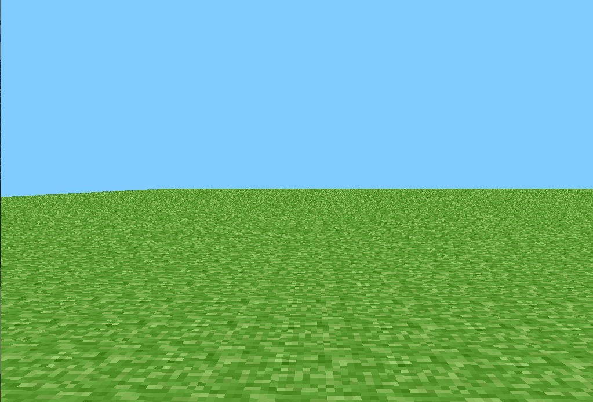
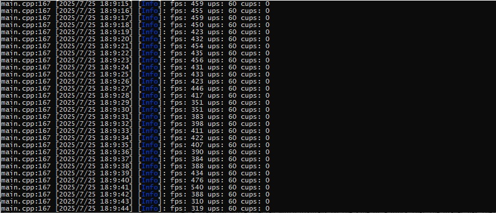

## Preclassic rd-132211

Launch date: May 13, 2009, 20:11 UTC (according to omniarchive)
c++ version launch date: Jul 25, 2025 21:07 UTC

 
Preview image from recreation.

## Introduction

This is a full port of Minecraft version rd-132211 written in C++, with the goal 
of preserving the *as-is* gameplay, performance, and stability of the original 
Java version. This code is based on the decompilation of the original '.jar' plus 
my own implementation from scratch of some critical sections of the original game, 
including a full port of the game using newer OpenGL versions (>3.3). Currently, 
this code is a very simple version of the Java version.

At the moment, the game does not have a full engine as such; in addition, it is 
designed to compile in the VS IDE and for Windows platforms.

## Limitation of liability

I, under my name, admit that this project is NOT endorsed by or affiliated with 
Mojang AB, which means that the above code is MY own as long as the copyright 
notice is observed.

## Copyright Notice

Copyright (C) 2025 Andres26

This project is licensed under GNU General Public License, version 3 (GPLv3)
See [LICENSE](../../../LICENSE) for more details.

## Contribute

Anyone is FREE to contribute to the project, if they are interested. I encourage 
anyone interested in this project to contribute to it.

You can contribute to the project as long as your code implements the original 
features of Minecraft. I recommend that before contributing to the code, you 
should be familiar with the original code for all Java versions (especially early versions) 
and the changelogs for older versions (see Omniarchive for more information). 

## Controls

In this version the controls do not differ from the original version, just so you keep 
it in mind:

- 'WASD' player move.
- 'R' for to restore the player's position to an arbitrary position in the level.
- 'SPACE' for jump.
- 'ESC' for exit.
- Right click for destroy block.
- Left click for put block.

## Technical summary and features of the game

This version of the game is a complete recreation of the original Java 
version. It's open source and reimplements some features of the original code.

- Rendering process: Unlike of the original version, this use shaders and 
  and only 1 draw call per chunk, the original version that used 2 drawing calls 
  for rendering the dark and light blocks which affected the game's performance.
  
- The FOG process was moved to 'chunk.shader', this allows avoid calls to prehistoric OpenGL.

   
  Fog demostration.
  
- The code does not support legacy OpenGL versions (<3.3)

- VBO indexer: An indexer is used for vertices (uses more memory in exchange for 
  fewer drawing calls to the GPU)
  
- The selector moves and rotates using the model matrix that the application 
  passes to the shader, which avoids unnecessary calls to GPU, each time the 
  cursor moves and repositions the selector on the selected block.
  
   
  Block selector demostration
  
- Chunk updates (CUPS): If a block is destroyed or a block on the edge of the chunk is 
  destroyed, it has to be updated for the above reason.
  
- Selector: This works as follows first it calculates the parametric equation of the camera 
  line 'f(t) = dir t + pos' and then, using a for loop, it sets the value of 't' 
  (every 0.1f) and finally the ray collides with the block and returns the normal vector
  of the impacted face.

## Original Assets

The code *as-is* does **NOT** have the original JE assets for legal reasons. So you'll have 
to get the original assets yourself, you can check the '.jar' that was used to rewrite it here.

Once this is done copy 'terrain.png' to the assets directory and the LWJGL logo to 'assets/Internal/win_icon.png'

## Level format

This is the simplest part of all and shouldn't cause any problems between the original 
Java version and the rewritten version. Both versions are fully compatible with 'level.dat' 
and use the same compression/decompression system (using GZIP). Loading 'level.dat' is 
optimized, unlike the original version. The process is as follows:

- The code checks if a 'level.dat' file exists.

- If it exists, it is decompressed, and the resulting buffer is passed to 'level->m_Blocks'.

- If not, 'level->m_Blocks' is created from scratch, and then the buffer is compressed into 
the 'level.dat' file, which is opened in binary mode for writing.

## Chunk functions

The Chunk class only acts as a renderer for the blocks being rendered on screen. The Level 
class creates a chunk map, preventing the object from being copied and deleted using 
m_ChunkRenderer.emplace. This prevents unnecessary operations during chunk creation. 
Chunks have a default size of 16 blocks. When generating the array, it is verified that 
adjacent blocks are rendered at a specific frame.

## Benchmarks and tests

In my case, I managed to get an average of 300 FPS in the debug version, and in 
the release version, it averaged 400 FPS. The game also takes a while to load at 
first due to the chunk renderer and the generation of the block array in the level.

 
FPS counter from my version.

## Dependencies, etc...

For those curious, the libraries used for this project are:

- GLFW 3.4
- GLAD for GLAPI=4.6 (view Include/lib/gfx/glad.h for more info :D )
- stb_image 2.30
- GLM 1.0.0
- ZLIB 1.3.1
- GLEQ for GLFW 3.0

## Run application

To run the application you must have a graphics card that supports modern versions of OpenGL (>3.3)

## Have fun!

Yes! After completing this process, you can now test version rd-133221 just like the 
original. The following versions will be available soon.

## Final notes

This clone of original rd-132211, does **NOT** pretend to be the best of the clones of this 
version on GitHub. At the moment, this is a very small test to show off the capabilities of 
the MC Engine. It's also not meant to be a project that goes too far; it was never intended 
to be anything more than a hobby. Probably the present code and the binaries published here 
will be useful to someone else, to contribute or create their own diffusions.

You can view [full demostration video.](https://www.youtube.com/watch?v=On8Z-XixrrU)

## That's all 

Now, you are ready for play and test the original version of rd-132211 in c++.

At the moment the game engine is very very simple. There are many implementations and abstractions 
missing from the engine, but the code is fully functional and shouldn't give you any problems (I hope).

If you find bugs in the program that are related to the code, initialization, 
etc. , feel free to report them via GitHub issues or in attached email. 

That's all, and we'll see each other again.

Andres26
Aug 26, 2025
minecraftrewrite21@gmai.com
